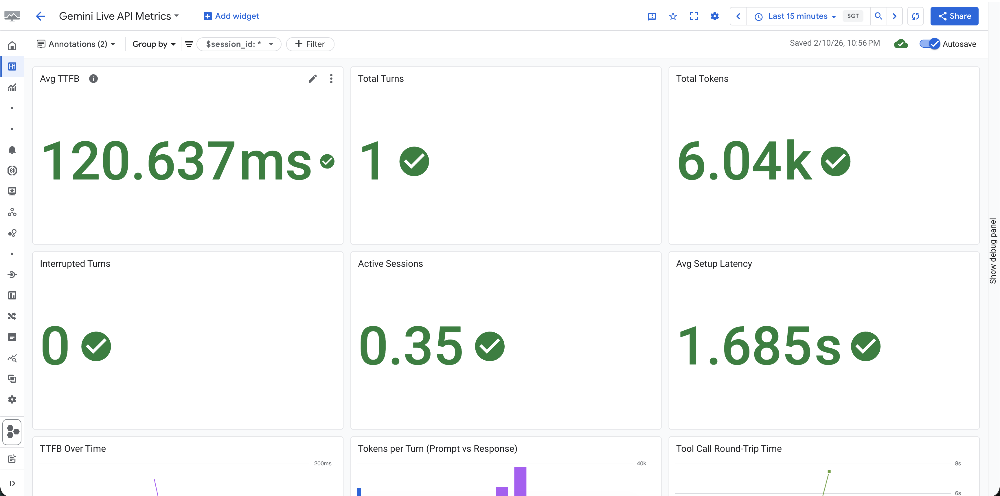
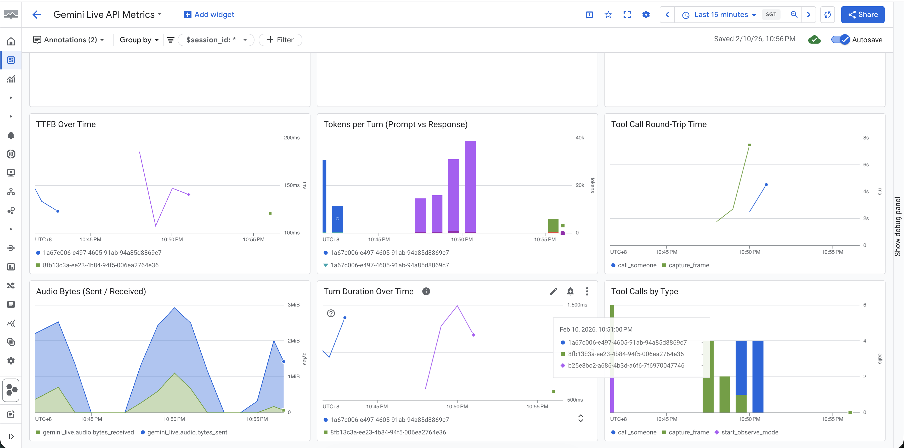

# Gemini Live API Telemetry

Non-intrusive instrumentation for the [Google Gemini Live API](https://cloud.google.com/vertex-ai/generative-ai/docs/live-api) (`google-genai` SDK). Automatically collects 65 metrics via [OpenTelemetry](https://opentelemetry.io/), exports to [Google Cloud Monitoring](https://cloud.google.com/monitoring) with an auto-created dashboard, and writes local JSON backup files.

**Zero code changes required** in your application. One `activate()` call at startup instruments the entire `google-genai` Live API SDK transparently.

## Features

- **Automatic instrumentation** via `wrapt` — patches 5 SDK methods (`_receive`, `send_realtime_input`, `send_client_content`, `send_tool_response`, `connect`)
- **65 metrics** across tokens, latency, turns, tool calls, audio, VAD, grounding, and session lifecycle
- **21 OTel instruments** (15 counters, 5 histograms, 1 UpDownCounter) exported to Google Cloud Monitoring
- **Auto-created Cloud Dashboard** with 12 widgets, session_id filter, and TTFB/token/tool charts
- **Local JSON backup** — full session data flushed to disk every 30s + on shutdown
- **Application-side JSONL logger** — for accuracy comparison against OTel metrics
- **Comparison CLI tool** — validates instrumentation accuracy between OTel and app-side logs
- **Per-session metrics** with global aggregation, queryable by session ID

## Quick Start

### Installation

[](https://pypi.org/project/gemini-live-telemetry/)

```bash
pip install gemini-live-telemetry
```

Or with [uv](https://docs.astral.sh/uv/):
```bash
uv add gemini-live-telemetry
```

### Usage

Add one call to your server startup — before any Gemini Live sessions are created:

```python
from gemini_live_telemetry import activate, InstrumentationConfig

activate(InstrumentationConfig(
    project_id="your-gcp-project-id",
))

# That's it. All google-genai Live API calls are now instrumented.
```

### What Happens

When `activate()` is called:

1. **wrapt** patches the `google-genai` SDK's `AsyncSession` and `AsyncLive` classes
2. **OpenTelemetry** MeterProvider is created with a Google Cloud Monitoring exporter
3. **JSON file exporter** starts writing session metrics to `./metrics/`
4. **Cloud Dashboard** "Gemini Live API Metrics" is auto-created in your GCP project
5. Every `connect()`, `_receive()`, `send_*()` call is intercepted and metrics are recorded

No changes to your application code. No changes to how you use the SDK.

## Configuration

```python
from gemini_live_telemetry import activate, InstrumentationConfig

activate(InstrumentationConfig(
    # GCP project for Cloud Monitoring (required for dashboard + GCP export)
    project_id="your-gcp-project-id",

    # Local file output
    metrics_dir="./metrics",               # JSON file directory
    log_dir="./metrics/logs",              # App-side JSONL log directory

    # Export settings
    enable_gcp_export=True,                # Push metrics to Cloud Monitoring
    enable_json_export=True,               # Write local JSON file
    enable_dashboard=True,                 # Auto-create Cloud dashboard

    # Timing
    export_interval_s=15.0,               # OTel export interval (min 10s)
    json_flush_interval_s=30.0,            # JSON file flush interval

    # Cloud Monitoring
    metric_prefix="workload.googleapis.com",  # Metric type prefix
    dashboard_name="Gemini Live API Metrics",  # Dashboard display name

    # Audio config (for duration calculations)
    input_sample_rate=16000,               # Input audio sample rate
    output_sample_rate=24000,              # Output audio sample rate
))
```

### Minimal Configuration

```python
# Uses defaults — reads project_id from GOOGLE_CLOUD_PROJECT env var
activate()
```

### Without GCP (local-only)

```python
activate(InstrumentationConfig(
    enable_gcp_export=False,
    enable_dashboard=False,
))
```

## Querying Metrics

### In-Memory Store (real-time)

```python
from gemini_live_telemetry import get_metrics_store

store = get_metrics_store()

# Per-session metrics
session = store.get_session("session-id-from-gemini")
agg = session.compute_aggregates()
print(f"Turns: {agg.total_turns}")
print(f"Avg TTFB: {agg.avg_ttfb_ms}ms")
print(f"Total tokens: {agg.session_total_tokens}")
print(f"Tool calls: {agg.total_tool_calls}")

# List all sessions
for s in store.list_sessions():
    print(f"{s.session_id}: {s.total_turns} turns, {s.total_tokens} tokens")

# Global aggregates (across all sessions since server start)
global_agg = store.get_global_aggregates()
print(f"Total sessions: {global_agg.total_sessions}")
print(f"P95 TTFB: {global_agg.p95_ttfb_ms}ms")
```

### JSON File (persistent)

```python
import json

with open("metrics/metrics_2026-02-10T10-00-00.json") as f:
    data = json.load(f)

# Global aggregates
print(data["global_aggregates"]["total_tokens"])

# Per-session
session = data["sessions"]["session-id"]
for turn in session["turns"]:
    print(f"Turn {turn['turn_number']}: {turn['usage']['total_token_count']} tokens")
```

## Cloud Dashboard

When `enable_gcp_export=True` (the default), the package auto-creates a custom dashboard named **"Gemini Live API Metrics"** in your Google Cloud project.

### How to Find the Dashboard

1. Open [Google Cloud Console](https://console.cloud.google.com)
2. Select your project (the `project_id` you configured)
3. Navigate to **Monitoring** > **Dashboards** (left sidebar)
4. Look for **"Gemini Live API Metrics"** under **Custom Dashboards**
5. Or go directly: `https://console.cloud.google.com/monitoring/dashboards?project=YOUR_PROJECT_ID`

The dashboard name is configurable via `InstrumentationConfig(dashboard_name="...")`. Default: `"Gemini Live API Metrics"`.

### Dashboard Preview

**Scorecards** — Avg TTFB, Total Turns, Total Tokens, Interrupted Turns, Active Sessions, Avg Setup Latency:



**Time Series Charts** — TTFB Over Time, Tokens per Turn (Prompt vs Response), Tool Call Round-Trip Time, Audio Bytes (Sent/Received), Turn Duration Over Time, Tool Calls by Type:



### Dashboard Widgets

| Widget | Type | Data |
|---|---|---|
| Avg TTFB | Scorecard | Time to first byte (500ms yellow, 1000ms red thresholds) |
| Total Turns | Scorecard | Completed conversation turns |
| Total Tokens | Scorecard | Prompt + response tokens |
| Interrupted Turns | Scorecard | Turns interrupted by user |
| Active Sessions | Scorecard | Currently active Gemini sessions |
| Avg Setup Latency | Scorecard | WebSocket connect to setup_complete |
| TTFB Over Time | Line chart | Per-session TTFB trend |
| Tokens per Turn | Stacked bar | Prompt vs response tokens |
| Tool Call Round-Trip | Line chart | Per-tool-name round-trip time |
| Audio Bytes | Stacked area | Sent vs received audio data |
| Turn Duration | Line chart | Per-session turn duration |
| Tool Calls by Type | Stacked bar | Per-tool-name call count |

**Filter:** Use the `$session_id` dropdown at the top to filter all widgets by a specific Gemini session.

### IAM Requirements

The service account needs these roles:

| Role | Purpose |
|---|---|
| `roles/monitoring.editor` | Write custom metrics |
| `roles/monitoring.dashboardEditor` | Create/update dashboards |

```bash
gcloud projects add-iam-policy-binding YOUR_PROJECT \
    --member="serviceAccount:YOUR_SA@YOUR_PROJECT.iam.gserviceaccount.com" \
    --role="roles/monitoring.editor"

gcloud projects add-iam-policy-binding YOUR_PROJECT \
    --member="serviceAccount:YOUR_SA@YOUR_PROJECT.iam.gserviceaccount.com" \
    --role="roles/monitoring.dashboardEditor"
```

## Application-Side Logger

For accuracy comparison, add manual metric logging alongside the automatic instrumentation:

```python
from gemini_live_telemetry import get_app_logger

logger = get_app_logger()

# Log at the same code points where metrics are computed
logger.log_ttfb(session_id, ttfb_ms=312.5, vad_mode="native")
logger.log_turn_complete(session_id, turn_number=1, duration_ms=5200,
                         was_interrupted=False, usage={...})
logger.log_tokens(session_id, prompt=200, response=80, total=280)
logger.log_tool_call(session_id, tool_id="tc_1", tool_name="search", args={...})
logger.log_tool_response(session_id, tool_id="tc_1", tool_name="search",
                         round_trip_ms=8050.0)
logger.log_session_start(session_id, model="gemini-live-2.5-flash")
logger.log_session_end(session_id, duration_ms=60000)
logger.log_setup_latency(session_id, latency_ms=425.0)
logger.log_audio_sent(session_id, bytes_count=32000)
logger.log_audio_received(session_id, bytes_count=48000)
logger.log_vad_event(session_id, event_type="VAD_SIGNAL_TYPE_EOS", source="native")
logger.log_grounding(session_id, chunk_count=3, confidence_scores=[0.9, 0.8])
```

Output: JSONL file at `metrics/logs/app_metrics_<timestamp>.jsonl`

## Comparison Tool

Compare OTel-collected metrics against application-side logs to validate accuracy:

```bash
# Text report
gemini-live-compare --otel metrics/metrics_*.json --app metrics/logs/app_metrics_*.jsonl

# JSON output
gemini-live-compare --otel metrics.json --app app.jsonl --json

# Custom tolerance (default: 5ms for timing metrics)
gemini-live-compare --otel metrics.json --app app.jsonl --timing-tolerance 10.0
```

Example output:
```
============================================================
  ACCURACY COMPARISON REPORT
============================================================
  Sessions compared:  2
  Metrics compared:   26

  MATCHES:       26  (100.0%)
  MISMATCHES:     0  (0.0%)
  MISSING_OTEL:   0
  MISSING_APP:    0
============================================================

  All metrics match. Instrumentation is accurate.
============================================================
```

Exit code: `0` if all match, `1` if any mismatch.

## Metrics Reference

### 65 Total Metrics

#### Tier 1: SDK-Exposed (29 metrics)

Read directly from `LiveServerMessage` fields on every `_receive()` call.

| # | Metric | Type | Source |
|---|---|---|---|
| 1 | `prompt_token_count` | Counter | `usage_metadata` |
| 2 | `response_token_count` | Counter | `usage_metadata` |
| 3 | `total_token_count` | Counter | `usage_metadata` |
| 4 | `cached_content_token_count` | Counter | `usage_metadata` |
| 5 | `tool_use_prompt_token_count` | Counter | `usage_metadata` |
| 6 | `thoughts_token_count` | Counter | `usage_metadata` |
| 7 | `prompt_tokens_by_modality` | Event | `usage_metadata.prompt_tokens_details` |
| 8 | `response_tokens_by_modality` | Event | `usage_metadata.response_tokens_details` |
| 9 | `cache_tokens_by_modality` | Event | `usage_metadata.cache_tokens_details` |
| 10 | `tool_use_tokens_by_modality` | Event | `usage_metadata.tool_use_prompt_tokens_details` |
| 11 | `traffic_type` | Attribute | `usage_metadata.traffic_type` |
| 12 | `turn_complete` | Counter | `server_content.turn_complete` |
| 13 | `turn_complete_reason` | Attribute | `server_content.turn_complete_reason` |
| 14 | `generation_complete` | Event | `server_content.generation_complete` |
| 15 | `interrupted` | Counter | `server_content.interrupted` |
| 16 | `waiting_for_input` | Event | `server_content.waiting_for_input` |
| 17 | `tool_call_count` | Counter | `tool_call.function_calls` |
| 18 | `tool_call_ids` | Event | `tool_call.function_calls[].id` |
| 19 | `tool_call_cancellation_ids` | Counter | `tool_call_cancellation.ids` |
| 20 | `grounding_chunk_count` | Counter | `grounding_metadata.grounding_chunks` |
| 21 | `google_search_retrieval_score` | Event | `grounding_metadata.retrieval_metadata` |
| 22 | `grounding_confidence_scores` | Event | `grounding_supports[].confidence_scores` |
| 23 | `web_search_queries` | Event | `grounding_metadata.web_search_queries` |
| 24 | `input_transcription` | Event | `server_content.input_transcription` |
| 25 | `output_transcription` | Event | `server_content.output_transcription` |
| 26 | `vad_signal` | Event | `voice_activity_detection_signal` |
| 27 | `voice_activity` | Event | `voice_activity` |
| 28 | `session_resumption_state` | Event | `session_resumption_update` |
| 29 | `go_away_time_left` | Event | `go_away.time_left` |

#### Tier 2: Computed via Instrumentation (20 metrics)

Computed from timestamp deltas by wrapping SDK methods.

| # | Metric | Type | Computation |
|---|---|---|---|
| 30 | `ttfb_ms` (native VAD) | Histogram | VAD EOS signal → first audio response |
| 31 | `ttfb_ms` (custom VAD) | Histogram | `activity_end` sent → first audio response |
| 32 | `turn_response_duration_ms` | Histogram | First model content → `turn_complete` |
| 33 | `tool_call_round_trip_ms` | Histogram | Tool call received → `send_tool_response` called |
| 34 | `session_duration_ms` | Store | `connect()` entry → exit |
| 35 | `setup_latency_ms` | Histogram | WebSocket open → `setup_complete` |
| 36 | `audio_bytes_sent` | Counter | `len(audio.data)` in `send_realtime_input` |
| 37 | `audio_bytes_received` | Counter | `len(inline_data.data)` in `_receive` |
| 38 | `audio_duration_sent_ms` | Derived | bytes / (sample_rate * bytes_per_sample) * 1000 |
| 39 | `audio_duration_received_ms` | Derived | bytes / (sample_rate * bytes_per_sample) * 1000 |
| 40 | `messages_sent_count` | Counter | Count of all `send_*()` calls |
| 41 | `messages_received_count` | Counter | Count of all `_receive()` returns |
| 42 | `send_realtime_input_count` | Counter | Via `method` label on messages.sent |
| 43 | `send_tool_response_count` | Counter | Via `method` label on messages.sent |
| 44 | `inter_turn_gap_ms` | Histogram | `turn_complete` N → first content N+1 |
| 45 | `vad_sos_to_first_content_ms` | Histogram | SOS signal → first model audio |
| 46 | `activity_start_sent` | Event | Timestamp of `send_realtime_input(activity_start=...)` |
| 47 | `activity_end_sent` | Event | Timestamp of `send_realtime_input(activity_end=...)` |
| 48 | `audio_stream_end_sent` | Event | Timestamp of `send_realtime_input(audio_stream_end=True)` |
| 49 | `active_sessions` | UpDownCounter | +1 on connect, -1 on disconnect |

#### Tier 3: Session Aggregates (16 metrics)

Computed on-demand from Tier 1 + 2. Cloud Monitoring computes these natively from raw time series.

| # | Metric | Derivation |
|---|---|---|
| 50 | `total_turns` | Count of `turn_complete` events |
| 51 | `total_interrupted_turns` | Count of `interrupted=True` |
| 52 | `interruption_rate` | `interrupted / total_turns` |
| 53 | `total_tool_calls` | Sum of tool call events |
| 54 | `total_tool_cancellations` | Sum of cancellation events |
| 55 | `tool_cancellation_rate` | `cancellations / tool_calls` |
| 56 | `session_total_prompt_tokens` | Sum of per-turn prompt tokens |
| 57 | `session_total_response_tokens` | Sum of per-turn response tokens |
| 58 | `session_total_tokens` | Sum of per-turn total tokens |
| 59 | `avg_ttfb_ms` | Mean of TTFB values |
| 60 | `p50_ttfb_ms` | Median TTFB |
| 61 | `p95_ttfb_ms` | 95th percentile TTFB |
| 62 | `p99_ttfb_ms` | 99th percentile TTFB |
| 63 | `avg_turn_response_duration_ms` | Mean turn duration |
| 64 | `avg_tool_call_round_trip_ms` | Mean tool round-trip |
| 65 | `total_grounding_invocations` | Count of grounding metadata events |

### 21 OTel Instruments (Cloud Monitoring)

| Instrument | Name | Unit | Labels |
|---|---|---|---|
| Counter | `gemini_live.turns.total` | 1 | `session_id` |
| Counter | `gemini_live.turns.interrupted` | 1 | `session_id` |
| Counter | `gemini_live.tokens.prompt` | 1 | `session_id` |
| Counter | `gemini_live.tokens.response` | 1 | `session_id` |
| Counter | `gemini_live.tokens.total` | 1 | `session_id` |
| Counter | `gemini_live.tokens.cached` | 1 | `session_id` |
| Counter | `gemini_live.tokens.tool_use` | 1 | `session_id` |
| Counter | `gemini_live.tokens.thoughts` | 1 | `session_id` |
| Counter | `gemini_live.tool_calls.total` | 1 | `session_id`, `tool_name` |
| Counter | `gemini_live.tool_calls.cancellations` | 1 | `session_id` |
| Counter | `gemini_live.messages.sent` | 1 | `session_id`, `method` |
| Counter | `gemini_live.messages.received` | 1 | `session_id` |
| Counter | `gemini_live.audio.bytes_sent` | By | `session_id` |
| Counter | `gemini_live.audio.bytes_received` | By | `session_id` |
| Counter | `gemini_live.grounding.invocations` | 1 | `session_id` |
| Histogram | `gemini_live.latency.ttfb_ms` | ms | `session_id`, `vad_mode` |
| Histogram | `gemini_live.latency.turn_duration_ms` | ms | `session_id` |
| Histogram | `gemini_live.latency.tool_round_trip_ms` | ms | `session_id`, `tool_name` |
| Histogram | `gemini_live.latency.inter_turn_gap_ms` | ms | `session_id` |
| Histogram | `gemini_live.latency.setup_ms` | ms | `session_id` |
| UpDownCounter | `gemini_live.sessions.active` | 1 | — |

## How It Works

```
┌──────────────────────────────────────────────────────────────────┐
│  Your Application                                                │
│                                                                  │
│  from gemini_live_telemetry import activate                      │
│  activate(config)                                                │
│                                                                  │
│  # Normal SDK usage — nothing changes                            │
│  async with client.aio.live.connect(model=...) as session:       │
│      await session.send_realtime_input(audio=...)                │
│      async for msg in session.receive():                         │
│          ...                                                     │
└──────────────────────────────────────────────────────────────────┘
            │ wrapt patches intercept SDK calls
            ▼
┌──────────────────────────────────────────────────────────────────┐
│  gemini-live-telemetry                                           │
│                                                                  │
│  ┌────────────────┐  ┌─────────────────────────────────────────┐ │
│  │ In-Memory Store │  │ OpenTelemetry MeterProvider             │ │
│  │ (per-session)   │  │  → Cloud Monitoring Exporter (15s)     │ │
│  └───────┬────────┘  └──────────────────┬──────────────────────┘ │
│          │                               │                       │
│    ┌─────▼──────┐                  ┌─────▼──────────┐            │
│    │ JSON File   │                  │ Cloud Dashboard │            │
│    │ (30s flush)  │                  │ (auto-created)  │            │
│    └────────────┘                  └────────────────┘            │
└──────────────────────────────────────────────────────────────────┘
```

### Wrapped SDK Methods

| Method | What's Captured |
|---|---|
| `AsyncSession._receive()` | All 29 SDK-exposed metrics (tokens, turns, tools, VAD, grounding, audio bytes) |
| `AsyncSession.send_realtime_input()` | Audio bytes sent, activity signals, message count |
| `AsyncSession.send_client_content()` | Message count |
| `AsyncSession.send_tool_response()` | Tool round-trip time, message count |
| `AsyncLive.connect()` | Session lifecycle, setup latency, active sessions |

## Pipecat Integration

This package works with [Pipecat](https://github.com/pipecat-ai/pipecat), the open-source framework for building voice and multimodal AI pipelines.

### Why It Works

Pipecat's Gemini Live service (`pipecat.services.google.gemini_live`) uses the `google-genai` SDK internally — it imports `google.genai.live.AsyncSession` directly and calls `client.aio.live.connect()`, `session.send_realtime_input()`, `session.send_client_content()`, `session.send_tool_response()`, and `session.receive()` for all communication with the Gemini Live API. Since `gemini-live-telemetry` instruments these exact SDK methods at the module level via `wrapt`, all of Pipecat's Gemini Live API traffic is captured automatically without any changes to Pipecat's code or your pipeline configuration.

### Step-by-Step Setup

**1. Install both packages:**

```bash
pip install pipecat-ai[google] gemini-live-telemetry
```

**2. Activate telemetry before creating your pipeline:**

```python
# app.py
from gemini_live_telemetry import activate, InstrumentationConfig

# Activate BEFORE any Pipecat imports that use the Gemini Live API
activate(InstrumentationConfig(
    project_id="your-gcp-project-id",
))

# Now use Pipecat normally
from pipecat.services.google.gemini_live.llm import GeminiLiveLLMService
from pipecat.pipeline.pipeline import Pipeline
from pipecat.pipeline.runner import PipelineRunner
from pipecat.pipeline.task import PipelineTask
from pipecat.transports.services.daily import DailyTransport

# Build your pipeline as usual
llm = GeminiLiveLLMService(
    api_key="your-api-key",
    model="gemini-2.0-flash-live-001",
    # ... your config
)

pipeline = Pipeline([transport.input(), llm, transport.output()])
task = PipelineTask(pipeline)
runner = PipelineRunner()
await runner.run(task)

# All Gemini Live API metrics are collected automatically:
# - TTFB, turn duration, token counts, audio bytes, tool round-trips
# - Exported to Cloud Monitoring dashboard + local JSON file
```

**3. View metrics:**

- **Cloud Console:** Monitoring > Dashboards > "Gemini Live API Metrics"
- **Local JSON:** `./metrics/metrics_<timestamp>.json`
- **In-code:**
  ```python
  from gemini_live_telemetry import get_metrics_store
  store = get_metrics_store()
  for s in store.list_sessions():
      print(f"{s.session_id}: {s.total_turns} turns, {s.avg_ttfb_ms}ms TTFB")
  ```

### Pipecat + Vertex AI

For Pipecat with Vertex AI (instead of API key), use `GeminiLiveVertexLLMService`:

```python
activate(InstrumentationConfig(
    project_id="your-gcp-project-id",
))

from pipecat.services.google.gemini_live.llm_vertex import GeminiLiveVertexLLMService

llm = GeminiLiveVertexLLMService(
    project_id="your-gcp-project-id",
    region="us-central1",
    model="gemini-2.0-flash-live-001",
)
# Works identically — same SDK methods, same telemetry
```

## Event Sinks — Real-Time Streaming

Stream telemetry events to Pub/Sub, webhooks, or custom sinks in real-time.
18 event types with `turn_number` correlation. See **[docs/event-sinks.md](docs/event-sinks.md)**.

```python
activate(InstrumentationConfig(
    enable_pubsub_export=True,
    pubsub_topic="gemini-live-telemetry",  # must be pre-created
))
```

> **Note:** The Pub/Sub topic must already exist. Create it with
> `gcloud pubsub topics create gemini-live-telemetry` before calling `activate()`.

## Requirements

- Python >= 3.10
- `google-genai` >= 1.5.0 (peer dependency)
- GCP credentials with Cloud Monitoring access (for GCP export)

## License

Apache 2.0
